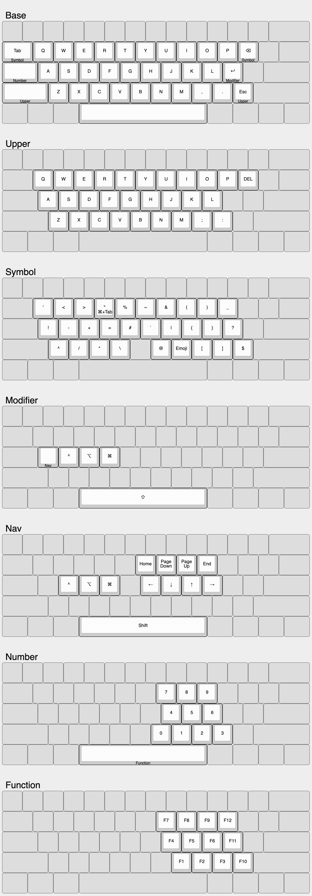

# karabiner-elements

## Layout

Goals:

- Activate a layer with the opposite hand from the key being pressed (similar to Miryoku).
- Use 5 columns × 3 rows for each hand, plus a single thumb key: the spacebar.
- Stay as close to QWERTY as possible to not mess with muscle memory and allow easy transition to/from tranditional, row-staggerd QWERTY keyboards. Even though some keys such as <kbd>;</kbd> and <kbd>/</kbd> are dropped from the Base layer, they are available in their usual position on another layer. Other keys such as <kbd>Backspace</kbd> and <kbd>Enter</kbd> may have moved but they maintain their relative position to each other and the alpha keys.

Note that the layout currently doesn't meet all of these goals. We currently need more than the desired 5 columns on each hand. On the left hand, we still need <kbd>Tab</kbd>, <kbd>Caps lock</kbd> and <kbd>Shift</kbd>. On the right hand we still need <kbd>[</kbd>. This is a work in progress.
 
[keyboard-layout.pdf](keyboard-layout.pdf)

### Base layer

Standard QWERTY alpha's, <kbd>,</kbd>, <kbd>.</kbd> and <kbd>Tab</kbd> are in their usual place. <kbd>Shift</kbd> on the left hand hasn't moved, but on the right it replaces <kbd>/</kbd>. Overall, this layer stays really close to a traditional, row-staggered QWERTY keyboard.

### Upper layer

Even closer to standard QWERTY. All keys are in their usual place.

<kbd>Shift</kbd> + <kbd>Backspace</kbd> maps to <kbd>Del</kbd>. 

### Symbol layer

Inspired by [Designing a Symbol Layer](https://getreuer.info/posts/keyboards/symbol-layer/index.html).

Emulate <kbd>⌘</kbd> + <kbd>Tab</kbd> and <kbd>⌘</kbd> + <kbd>⇧</kbd> + <kbd>Tab</kbd> with <kbd>Tab</kbd> + <kbd>R</kbd> and <kbd>Tab</kbd> + <kbd>E</kbd> respectively.

Note that the Symbol layer provides access to <kbd>&lt;</kbd> and <kbd>&gt;</kbd> which are already available on the Upper layer. This is to make typing arrows such as `->` and `=>` easier to type (this is pretty common when programming).

### Sticky modifier layer

As the name implies, all modifiers are sticky.

Holding <kbd>A</kbd> while in this layer activates the Navigation layer. Once active, you can release <kbd>;</kbd>.

### Navigation layer

Vim-style arrow keys.

With modifiers <kbd>⌘</kbd>, <kbd>⌥</kbd>, <kbd>^</kbd> and <kbd>⇧</kbd> available on the left hand (while holding <kbd>A</kbd> to keep this layer active), you can perform common navigation combo's such as <kbd>⌘</kbd> + <kbd>←</kbd>.

You can hold <kbd>Space</kbd> as a modifier or hit it once to toggle <kbd>Shift</kbd> on and off.

The Navigation layer includes <kbd>Home</kbd>, <kbd>End</kbd>, <kbd>Page up</kbd> and <kbd>Page down</kbd> one row above their corresponding arrows.

### Number layer

Has numbers arranged as a numpad.

Also provides quick access to keys removed from the Base layer (e.g. <kbd>;</kbd> and <kbd>/</kbd>) in their original positions.

Hitting <kbd>H</kbd> once in this layer activates the Function layer.

### Function layer

Mirrors the Number layer, and adds <kbd>F10</kbd>, <kbd>F11</kbd> and <kbd>F12</kbd> on the pinky column.

### How to obtain image(s)

Resize window to 700px. Open the Developer Tools. Press Cmd + Shift + P and type "screenshot". Select to take a screenshot of the entire website.

## To do

- Remove layer switching keys from the upper layer mapping (to vk_none)
- Move tab to shift + space
- Caps lock
- Cmd (+ Shift) + `

## To try?

Does simultaneous tab + r work? That means that the symbol layer only activates on other combination, and tab only works on release. Is that already the case?
