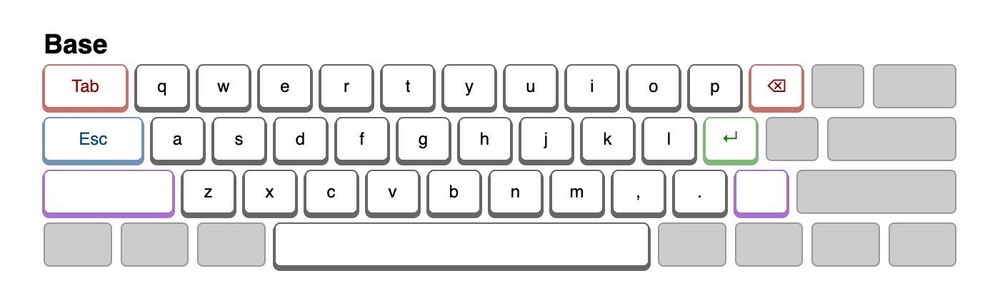
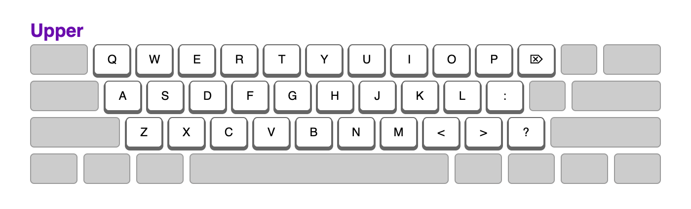
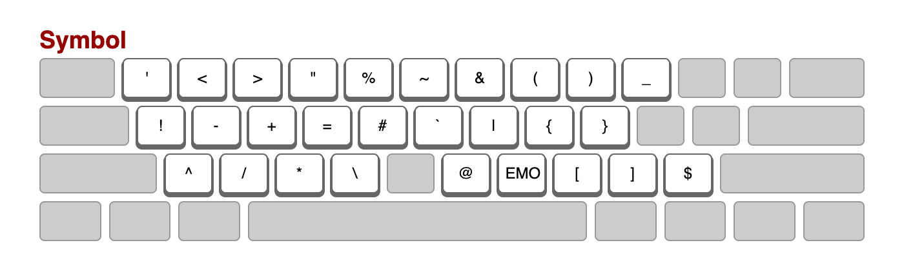
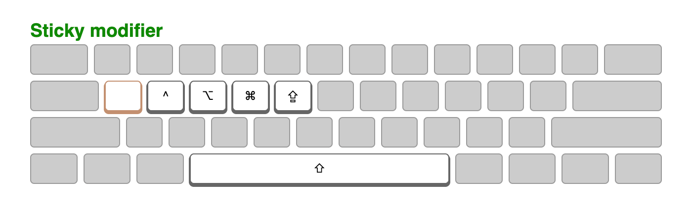
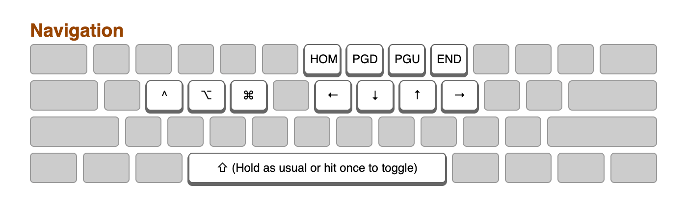
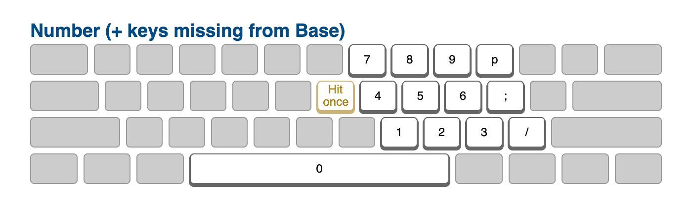
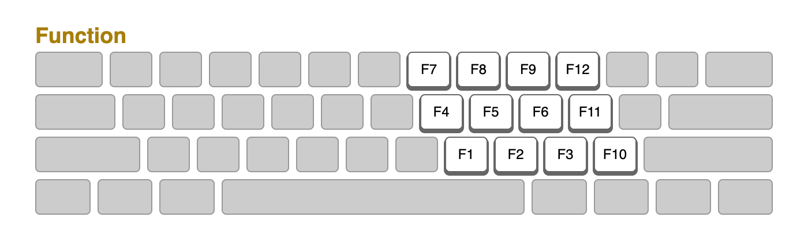

# karabiner-elements

## Layout

Goals:

- Activate a layer with the opposite hand from the key being pressed (similar to Miryoku).
- Use 5 columns × 3 rows for each hand, plus a single thumb key: the spacebar.
- Stay as close to QWERTY as possible to not mess with muscle memory and allow easy transition to/from tranditional, row-staggerd QWERTY keyboards. Even though some keys such as <kbd>;</kbd> and <kbd>/</kbd> are dropped from the Base layer, they are available in their usual position on another (easy to reach) layer. Other keys such as <kbd>Backspace</kbd> and <kbd>Enter</kbd> are available in the Base layer but have moved. However, they maintain their relative position to each other and the alpha keys.

Note that the layout currently doesn't meet all of these goals. We currently need more than the desired 5 columns on each hand. On the left hand, we still need <kbd>Tab</kbd>, <kbd>Caps lock</kbd> and <kbd>Shift</kbd>. On the right hand we still need <kbd>[</kbd>. This is a work in progress (taking small steps to reduce the toll adjusting to a new layout takes on my work).
 
[keyboard-layout.pdf](keyboard-layout.pdf)

### Base layer

Overall, this layer stays really close to a traditional, row-staggered QWERTY keyboard.

### Upper layer

Even closer to standard QWERTY. All keys are in their usual place.

### Symbol layer

Inspired by [Designing a Symbol Layer](https://getreuer.info/posts/keyboards/symbol-layer/index.html).

Note that the Symbol layer provides access to <kbd>&lt;</kbd> and <kbd>&gt;</kbd> which are already available on the Upper layer. This is to make typing arrows such as `->` and `=>` easier to type (which is pretty common when programming).

Similarly, <kbd>/</kbd> is availble on both the Symbol layer and the Number layer. Although I mostly just use the one from the Number layer, adding <kbd>/</kbd> to the Symbol layer nicely completes the square of mathematical operators.

### Sticky modifier layer

As the name implies, all modifiers are sticky. Also has <kbd>⇪</kbd> mapped to <kbd>G</kbd>.

Holding <kbd>A</kbd> while in this layer activates the Navigation layer. Once active, you can release <kbd>;</kbd>. It is also possible to hit <kbd>A</kbd> twice (within half a second) to toggle the Navigation layer. Return to the base layer by hitting <kbd>A</kbd> again.

### Navigation layer

With modifiers <kbd>⌘</kbd>, <kbd>⌥</kbd>, <kbd>^</kbd> and <kbd>⇧</kbd> available on the left hand, you can perform common navigation combo's such as <kbd>⌘</kbd> + <kbd>←</kbd>.

You can hold <kbd>Space</kbd> as a modifier or hit it once to toggle <kbd>Shift</kbd> on and off.

### Number (+ keys missing from Base) layer

Also provides quick access to keys missing from the Base layer (e.g. <kbd>;</kbd> and <kbd>/</kbd>) in their original positions.

Hitting <kbd>H</kbd> once in this layer activates the Function layer.

### Function layer

### Other combinations

There are a couple of same-hand combinations to enable switching between apps, windows and files:

- Apps: <kbd>⇥</kbd> + <kbd>R</kbd> and <kbd>⇥</kbd> + <kbd>E</kbd>
- Windows of the same app: <kbd>⇪</kbd> + <kbd>F</kbd> and <kbd>⇪</kbd> + <kbd>D</kbd>
- Tabs: <kbd>[</kbd> + <kbd>U</kbd> and <kbd>[</kbd> + <kbd>I</kbd>

### How to obtain image(s)

Resize window to 700px. Open the Developer Tools. Press Cmd + Shift + P and type "screenshot". Select to take a screenshot of the entire website. Each layer occupies 425px (or is it half?) of height.

## Why

### Why not use <kbd>Shift</kbd> instead of dedicated Upper layer?

Because the combo <kbd>Shift</kbd> + <kbd>Return</kbd> won't work.

## To do

- ; + j & k could be move up and down
- Navigation layer should send and exit on backspace, enter and esc. Only "raw" exit would be a and shift
- Add to docs:
    - double tap A from sticky modifier layer locks navigation layer
    - double tap shift for regular shift (not upper layer)
    - Shift + Tab on upper layer
- Introduce "Alt" layer with keys missing from base (one shot shift seems like a good fit)
- https://chatgpt.com/share/68e6b3ab-745c-8012-9760-11e10ea0ea2b
- Replace shift and caps lock and tab with symbols.
