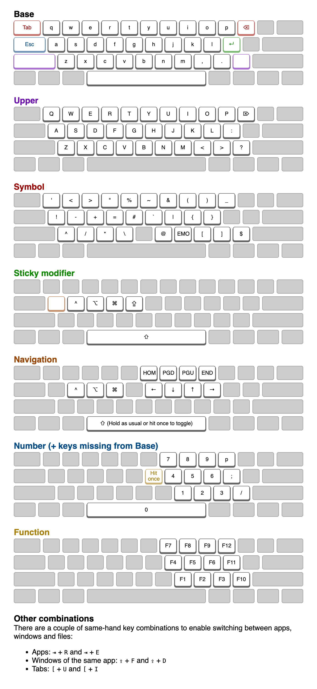

# karabiner-elements

## Keymap

### How to obtain image

Open the Developer Tools. Press Cmd + Shift + I and type "screenshot". Select to take a screenshot of the entire website.

## To do

- Go to nav-mode from number layer or shift layer
- Caps lock
- Cmd + Shift + Tab
- Cmd (+ Shift) + `

## To try?

Does simultaneous tab + r work? That means that the symbol layer only activates on other combination, and tab only works on release. Is that already the case?
